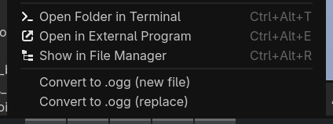
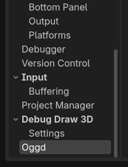

# oggd

A Godot 4 editor plugin that adds right-click conversion of audio files to OGG Vorbis directly from the FileSystem dock.

## Requirements

- Godot 4+
- [ffmpeg](https://ffmpeg.org/download.html) installed on your system

## Installation

1. Copy the `oggd` folder into `res://addons/` in your Godot project
2. Enable **oggd** in **Project > Project Settings > Plugins**

The plugin will warn you on startup if ffmpeg cannot be found.

## Usage

Right-click any supported audio file in the FileSystem dock and choose:

- **Convert to OGG**: creates a new `.ogg` file alongside the original
- **Replace with OGG**: converts and replaces the original file

Supported input formats:

- MP3
- WAV
- FLAC
- AAC
- M4A
- AIFF
- Opus
- WMA
- OGG
- OGX

You can select multiple files and convert them all at once.

## Configuration

Adjust Vorbis quality (0–10) under **Editor > Editor Settings > Oggd > Vorbis Quality**. Higher values mean better quality and larger files. Default is 6.

